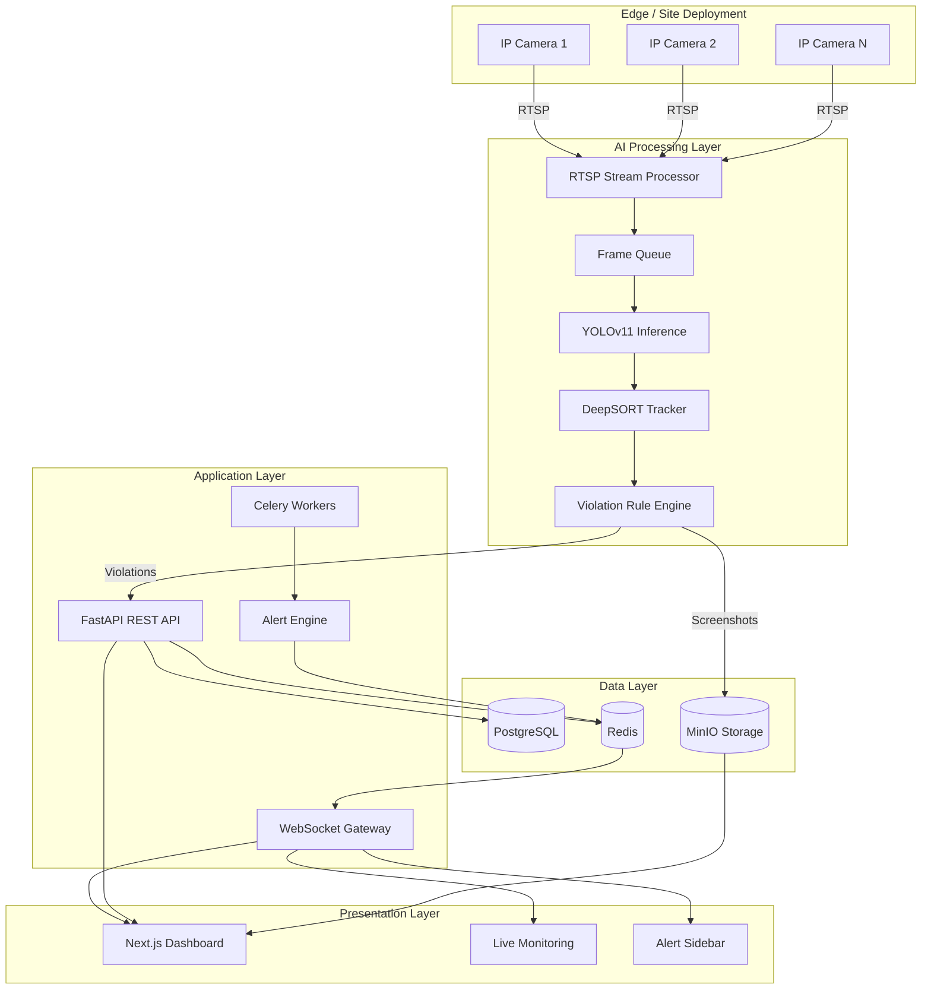

# System Architecture

## Tower AI Safety Monitoring System — Phase 1 MVP

---

## 1. High-Level Architecture



---

## 2. Service Architecture

### 2.1 Frontend (`/frontend`)

**Purpose**: Industrial control-room dashboard for safety operators.

| Component | Responsibility |
|-----------|---------------|
| `app/dashboard` | KPI stats, camera grid, recent violations |
| `app/monitoring` | Full-screen live camera feeds with overlays |
| `app/violations` | Violation history and incident management |
| `app/analytics` | Safety trend charts and compliance metrics |
| `components/monitoring` | Camera feed tiles, detection overlays |
| `hooks/use-websocket` | Real-time alert and detection streaming |
| `lib/api` | Typed REST API client |

**Design Decisions**:
- Next.js 15 App Router for server/client component separation
- Dark-mode industrial SaaS aesthetic (control room style)
- WebSocket hook with auto-reconnect for unreliable outdoor networks
- Zustand for client-side alert state (Step 12)

**Performance Targets**:
- 15 FPS dashboard streaming (metadata + overlays, not raw video)
- Sub-100ms alert notification latency

---

### 2.2 Backend (`/backend`)

**Purpose**: Central API gateway, auth, data persistence, WebSocket hub.

```
backend/
├── app/
│   ├── main.py              # FastAPI entry point
│   ├── core/
│   │   ├── config.py        # Pydantic settings
│   │   ├── security.py      # JWT + RBAC
│   │   └── logging.py       # Structured logging
│   ├── api/
│   │   ├── deps.py          # Dependency injection
│   │   └── v1/
│   │       ├── auth.py      # Login, token refresh
│   │       ├── cameras.py   # Camera CRUD
│   │       ├── violations.py
│   │       ├── alerts.py
│   │       └── dashboard.py
│   ├── db/
│   │   ├── session.py       # Async SQLAlchemy
│   │   └── models.py        # ORM models
│   ├── schemas/             # Pydantic request/response
│   ├── websocket/
│   │   └── manager.py       # Connection manager + channels
│   ├── tasks/
│   │   ├── alerts.py        # Celery alert tasks
│   │   └── incidents.py     # Health checks, archiving
│   └── celery_app.py
```

**Design Decisions**:
- Async SQLAlchemy 2.0 with asyncpg for non-blocking DB I/O
- JWT with role hierarchy (admin > supervisor > operator > viewer)
- WebSocket channels: `dashboard`, `alerts`, `cameras` for targeted broadcasting
- Celery for async violation processing (decouples AI engine from alert delivery)
- Structured JSON logging for production observability

**Scalability**:
- Stateless API servers behind Nginx load balancer
- Redis pub/sub bridges Celery workers to WebSocket connections
- Connection pooling (20 connections, 10 overflow)
- Horizontal scaling: add backend replicas, single PostgreSQL with read replicas

---

### 2.3 AI Engine (`/ai-engine`)

**Purpose**: Real-time computer vision pipeline for safety detection.

```
ai-engine/
├── app/
│   ├── main.py
│   ├── core/
│   │   ├── config.py
│   │   └── constants.py     # Detection class mappings
│   └── services/
│       ├── rtsp_processor.py    # Multi-camera RTSP ingestion
│       ├── inference.py         # YOLOv11 batch inference
│       ├── tracker.py           # DeepSORT worker tracking
│       └── violation_engine.py  # Safety rule evaluation
```

**Processing Pipeline**:

```
Frame Capture (15 FPS)
    → Sample every 3rd frame (5 FPS inference)
    → YOLOv11 Detection
    → DeepSORT Tracking (persistent worker IDs)
    → Violation Rule Engine
        ├── helmet_off (CRITICAL, threshold 0.45)
        ├── harness_off (CRITICAL, threshold 0.50)
        └── restricted_zone (MEDIUM, threshold 0.55)
    → Temporal Filter (3 consecutive frames)
    → Push to Backend + Redis
```

**Design Decisions**:
- Separate microservice isolates GPU workloads from API latency
- Temporal filtering reduces false positives in outdoor environments
- Lower confidence thresholds for critical violations (helmet/harness)
- RTSP auto-reconnect for unreliable outdoor camera networks
- Batch inference support for multi-camera sites

**Performance Targets**:
- 5 FPS AI inference per camera
- <200ms inference latency per frame (GPU)
- Support 10+ concurrent camera streams per GPU instance

**GPU Scaling**:
- Single NVIDIA T4: ~8-10 cameras at 5 FPS
- Multi-GPU: one AI engine container per GPU via Docker device mapping
- CPU fallback for development/testing

---

## 3. Data Flow

### 3.1 Violation Detection Flow

```
1. RTSP Processor captures frame from camera
2. Frame pushed to inference queue
3. YOLOv11 detects: person, helmet, no_helmet, harness, no_harness
4. DeepSORT assigns tracking_id to each person
5. Violation Engine checks:
   - Person without helmet → helmet_off (CRITICAL)
   - Person without harness → harness_off (CRITICAL)
   - Person in restricted polygon → restricted_zone (MEDIUM)
6. Temporal filter: require 3 consecutive frames
7. Screenshot captured → uploaded to MinIO
8. Violation POST to backend API
9. Celery task creates alert record
10. Redis pub/sub → WebSocket broadcast to dashboard
```

### 3.2 Live Dashboard Flow

```
1. Frontend connects to /ws WebSocket
2. AI engine publishes detection metadata to Redis
3. Backend WebSocket manager broadcasts to connected clients
4. Frontend renders bounding box overlays on camera feed tiles
5. New alerts appear in sidebar with severity color coding
```

---

## 4. Infrastructure

### 4.1 Docker Compose Services

| Service | Port | Purpose |
|---------|------|---------|
| nginx | 80 | Reverse proxy, WebSocket upgrade |
| frontend | 3000 | Next.js dashboard |
| backend | 8000 | FastAPI API + WebSocket |
| ai-engine | 8001 | YOLO inference pipeline |
| celery-worker | — | Async task processing |
| celery-beat | — | Scheduled health checks |
| postgres | 5432 | Primary database |
| redis | 6379 | Cache, pub/sub, Celery broker |
| minio | 9000/9001 | Object storage |

### 4.2 Network Topology

All services communicate via `towerai-network` Docker bridge. Nginx is the single entry point for external traffic. AI engine communicates with backend via internal HTTP. MinIO stores violation screenshots and recording segments.

### 4.3 Offline / Poor Connectivity

For remote outdoor deployments with intermittent connectivity:
- AI engine processes locally (edge deployment)
- Violations queued in Redis when backend unreachable
- Dashboard caches last-known state in browser localStorage
- RTSP streams processed locally regardless of internet status

---

## 5. Security Architecture

| Layer | Mechanism |
|-------|-----------|
| Authentication | JWT access + refresh tokens |
| Authorization | RBAC with 4 roles |
| Transport | HTTPS-ready via Nginx (TLS termination) |
| Passwords | bcrypt hashing (12 rounds) |
| API | Bearer token on all protected endpoints |
| Audit | audit_logs table for compliance |
| Secrets | Environment variables, never committed |

---

## 6. Scalability Roadmap

| Phase | Scale | Architecture Change |
|-------|-------|-------------------|
| MVP (Phase 1) | 1-5 cameras | Single Docker Compose stack |
| Phase 2 | 5-50 cameras | Separate AI engine per site, centralized backend |
| Phase 3 | 50-500 cameras | Kubernetes, multi-region, read replicas |
| Phase 4 | Enterprise | Edge AI boxes, federated learning, multi-tenant |

---

## 7. Monitoring & Observability (Future)

- Structured JSON logs → centralized log aggregation
- Prometheus metrics on `/metrics` endpoints
- Health checks on all services
- Camera uptime tracking via Celery beat
- GPU utilization monitoring for AI engine
