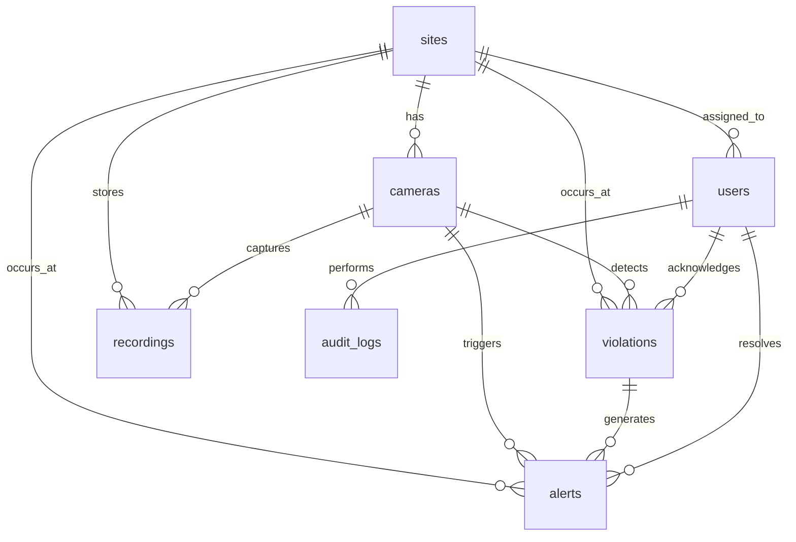

# Database Schema Reference

## Tower AI Safety Monitoring System — PostgreSQL 16

---

## Entity Relationship Diagram



---

## Tables

### `sites`

Physical deployment locations (tower sites, construction zones).

| Column | Type | Constraints | Description |
|--------|------|-------------|-------------|
| id | UUID | PK, DEFAULT uuid_generate_v4() | Unique site identifier |
| name | VARCHAR(255) | NOT NULL | Display name |
| code | VARCHAR(50) | UNIQUE, NOT NULL | Short code (e.g., DEMO-001) |
| description | TEXT | | Site description |
| address | TEXT | | Physical address |
| latitude | DECIMAL(10,8) | | GPS latitude |
| longitude | DECIMAL(11,8) | | GPS longitude |
| timezone | VARCHAR(50) | DEFAULT 'UTC' | Site timezone |
| is_active | BOOLEAN | DEFAULT TRUE | Active flag |
| created_at | TIMESTAMPTZ | DEFAULT NOW() | |
| updated_at | TIMESTAMPTZ | DEFAULT NOW() | Auto-updated via trigger |

---

### `users`

Platform operators with role-based access control.

| Column | Type | Constraints | Description |
|--------|------|-------------|-------------|
| id | UUID | PK | |
| email | VARCHAR(255) | UNIQUE, NOT NULL | Login email |
| password_hash | VARCHAR(255) | NOT NULL | bcrypt hash |
| full_name | VARCHAR(255) | NOT NULL | Display name |
| role | user_role | NOT NULL, DEFAULT 'viewer' | admin, supervisor, operator, viewer |
| site_id | UUID | FK → sites.id | Assigned site (nullable for admin) |
| is_active | BOOLEAN | DEFAULT TRUE | |
| last_login_at | TIMESTAMPTZ | | Last successful login |
| created_at | TIMESTAMPTZ | DEFAULT NOW() | |
| updated_at | TIMESTAMPTZ | DEFAULT NOW() | |

**Role Permissions**:

| Role | Cameras | Violations | Alerts | Users | Settings |
|------|---------|------------|--------|-------|----------|
| admin | CRUD | CRUD | CRUD | CRUD | CRUD |
| supervisor | CRUD | Read/Ack | CRUD | Read | Read |
| operator | Read | Read/Ack | Update | — | — |
| viewer | Read | Read | Read | — | — |

---

### `cameras`

RTSP/IP camera registry with restricted zone configuration.

| Column | Type | Constraints | Description |
|--------|------|-------------|-------------|
| id | UUID | PK | |
| site_id | UUID | FK → sites.id, NOT NULL | Parent site |
| name | VARCHAR(255) | NOT NULL | Display name |
| code | VARCHAR(50) | NOT NULL | Camera code (unique per site) |
| rtsp_url | TEXT | NOT NULL | RTSP stream URL |
| location_label | VARCHAR(255) | | Physical location description |
| latitude | DECIMAL(10,8) | | Camera GPS |
| longitude | DECIMAL(11,8) | | Camera GPS |
| status | camera_status | DEFAULT 'offline' | online, offline, error, maintenance |
| fps | INTEGER | DEFAULT 15 | Target capture FPS |
| resolution | VARCHAR(20) | DEFAULT '1920x1080' | Stream resolution |
| restricted_zones | JSONB | DEFAULT '[]' | Array of polygon coordinates [[x,y],...] normalized 0-1 |
| is_active | BOOLEAN | DEFAULT TRUE | |
| last_seen_at | TIMESTAMPTZ | | Last successful frame capture |
| created_at | TIMESTAMPTZ | DEFAULT NOW() | |
| updated_at | TIMESTAMPTZ | DEFAULT NOW() | |

**restricted_zones format**:
```json
[
  [0.1, 0.2, 0.5, 0.2, 0.5, 0.8, 0.1, 0.8],
  [0.6, 0.1, 0.9, 0.1, 0.9, 0.5, 0.6, 0.5]
]
```
Each array is a flat list of normalized [x,y] polygon vertices.

---

### `violations`

AI-detected safety violations with evidence.

| Column | Type | Constraints | Description |
|--------|------|-------------|-------------|
| id | UUID | PK | |
| camera_id | UUID | FK → cameras.id, NOT NULL | Source camera |
| site_id | UUID | FK → sites.id, NOT NULL | Site |
| violation_type | violation_type | NOT NULL | helmet_off, harness_off, restricted_zone |
| severity | violation_severity | NOT NULL | critical, medium, low |
| confidence | DECIMAL(5,4) | NOT NULL, CHECK 0-1 | AI confidence score |
| tracking_id | VARCHAR(100) | | DeepSORT worker tracking ID |
| bounding_boxes | JSONB | NOT NULL | All detections in frame |
| screenshot_url | TEXT | | Public URL to violation screenshot |
| screenshot_key | VARCHAR(500) | | MinIO object key |
| frame_timestamp | TIMESTAMPTZ | NOT NULL | Exact frame capture time |
| metadata | JSONB | DEFAULT '{}' | Additional context |
| is_acknowledged | BOOLEAN | DEFAULT FALSE | |
| acknowledged_by | UUID | FK → users.id | |
| acknowledged_at | TIMESTAMPTZ | | |
| created_at | TIMESTAMPTZ | DEFAULT NOW() | |

**bounding_boxes format**:
```json
[
  {
    "class_name": "person",
    "x": 0.45, "y": 0.62, "w": 0.12, "h": 0.35,
    "confidence": 0.89,
    "tracking_id": "worker_3"
  },
  {
    "class_name": "no_helmet",
    "x": 0.46, "y": 0.30, "w": 0.08, "h": 0.10,
    "confidence": 0.72,
    "tracking_id": null
  }
]
```

---

### `alerts`

Real-time alert records linked to violations.

| Column | Type | Constraints | Description |
|--------|------|-------------|-------------|
| id | UUID | PK | |
| violation_id | UUID | FK → violations.id, NOT NULL | Source violation |
| camera_id | UUID | FK → cameras.id, NOT NULL | |
| site_id | UUID | FK → sites.id, NOT NULL | |
| title | VARCHAR(255) | NOT NULL | Alert title |
| message | TEXT | NOT NULL | Alert description |
| severity | violation_severity | NOT NULL | |
| status | alert_status | DEFAULT 'pending' | pending, acknowledged, resolved, dismissed |
| assigned_to | UUID | FK → users.id | |
| resolved_by | UUID | FK → users.id | |
| resolved_at | TIMESTAMPTZ | | |
| resolution_note | TEXT | | Operator notes |
| created_at | TIMESTAMPTZ | DEFAULT NOW() | |
| updated_at | TIMESTAMPTZ | DEFAULT NOW() | |

---

### `recordings`

Camera recording segments stored in MinIO.

| Column | Type | Constraints | Description |
|--------|------|-------------|-------------|
| id | UUID | PK | |
| camera_id | UUID | FK → cameras.id, NOT NULL | |
| site_id | UUID | FK → sites.id, NOT NULL | |
| file_url | TEXT | | Public URL |
| file_key | VARCHAR(500) | | MinIO object key |
| file_size_bytes | BIGINT | | File size |
| duration_seconds | INTEGER | | Recording duration |
| start_time | TIMESTAMPTZ | NOT NULL | Recording start |
| end_time | TIMESTAMPTZ | | Recording end |
| status | recording_status | DEFAULT 'recording' | recording, completed, failed, archived |
| metadata | JSONB | DEFAULT '{}' | |
| created_at | TIMESTAMPTZ | DEFAULT NOW() | |

---

### `audit_logs`

Security and compliance audit trail.

| Column | Type | Constraints | Description |
|--------|------|-------------|-------------|
| id | UUID | PK | |
| user_id | UUID | FK → users.id | Acting user |
| action | VARCHAR(100) | NOT NULL | Action performed |
| resource_type | VARCHAR(100) | | Target resource type |
| resource_id | UUID | | Target resource ID |
| details | JSONB | DEFAULT '{}' | Action details |
| ip_address | INET | | Client IP |
| user_agent | TEXT | | Client user agent |
| created_at | TIMESTAMPTZ | DEFAULT NOW() | |

---

## Indexes

All foreign keys and frequently queried columns are indexed. Critical query patterns:

```sql
-- Dashboard: today's violations by type
SELECT violation_type, COUNT(*) FROM violations
WHERE created_at >= CURRENT_DATE GROUP BY violation_type;

-- Live monitoring: pending alerts
SELECT * FROM alerts WHERE status = 'pending'
ORDER BY created_at DESC LIMIT 20;

-- Analytics: violations per camera over time range
SELECT camera_id, DATE(created_at), COUNT(*)
FROM violations
WHERE created_at BETWEEN $1 AND $2
GROUP BY camera_id, DATE(created_at);
```

---

## Seed Data

The init script creates:
- 1 demo site (`DEMO-001`)
- 1 admin user (`admin@towerai.local`)
- 1 demo camera (`CAM-001`)
